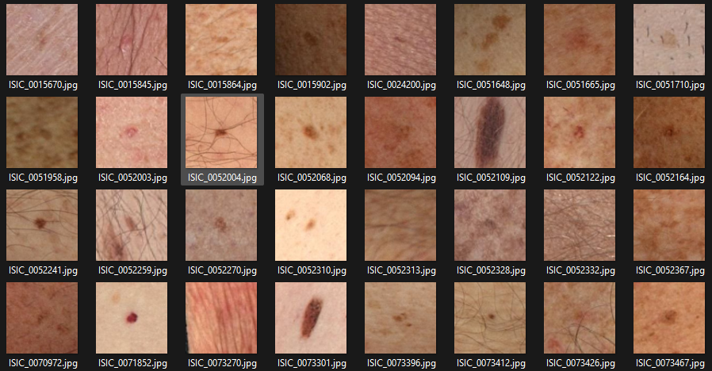
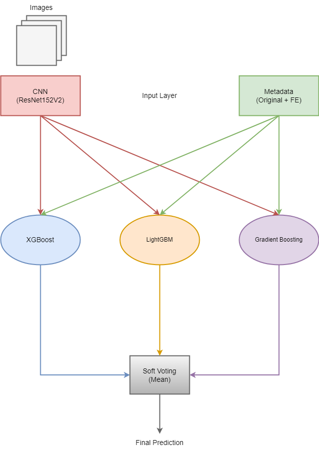
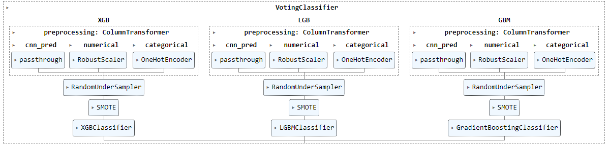

  

# Skin Cancer Detection Project

## Authors

[Mila Miletic](https://www.linkedin.com/in/mila-miletic-19168a123/)    
[Sergio Sanz](https://www.linkedin.com/in/sergio-sanz-rodriguez/)

## Overview

This project belongs to a Kaggle competition on [ISIC 2024 - Skin Cancer Detection with 3D-TBP](https://www.kaggle.com/competitions/isic-2024-challenge/overview) with a submission deadline on September 6, 2024.

The project focuses on the development of machine learning (ML) and deep learning (DL) algorithms to identify histologically confirmed skin cancer cases with single-lesion crops from body images. In addition to the image database, a comprehensive set of metadata information related to the lesion is used to train the models. For more information about the metadata features, please visit the aforementioned link. In this challenge a binary classification system is built, tested and evaluated, combining image-based deep learning neural networks with advanced machine learning models to identify whether the sample corresponds to a benign or a malignant case. 

## Description (from Kaggle Website)
Skin cancer can be deadly if not caught early, but many populations lack specialized dermatologic care. Over the past several years, dermoscopy-based AI algorithms have been shown to benefit clinicians in diagnosing melanoma, basal cell, and squamous cell carcinoma. However, determining which individuals should see a clinician in the first place has great potential impact. Triaging applications have a significant potential to benefit underserved populations and improve early skin cancer detection, the key factor in long-term patient outcomes.

Dermatoscope images reveal morphologic features not visible to the naked eye, but these images are typically only captured in dermatology clinics. Algorithms that benefit people in primary care or non-clinical settings must be adept to evaluating lower quality images. This competition leverages 3D TBP to present a novel dataset of every single lesion from thousands of patients across three continents with images resembling cell phone photos.

This competition aims to develop AI algorithms that differentiate histologically-confirmed malignant skin lesions from benign lesions on a patient. This work will help to improve early diagnosis and disease prognosis by extending the benefits of automated skin cancer detection to a broader population and settings.

## Evaluation Metric

The metric that has been used in the project is the [partial area under the ROC curve](https://en.wikipedia.org/wiki/Partial_Area_Under_the_ROC_Curve) (pAUC) above 80% true positive rate (TPR) for binary classification of malignant examples. (See the implementation in the notebook [ISIC pAUC-aboveTPR](https://www.kaggle.com/code/metric/isic-pauc-abovetpr).)

## Challenges

Apart from the magnitude of its complexity, the main challenge of this project is working with an extremely imbalanced dataset. Specifically, the database includes about 400 malignant cases versus 400,000 benign cases, 1,000 more benign cases than malignant lesions.

Another key aspect to highlight is that there is no feature in the metadata that is highly correlated with the target. An in-depth analysis of the metadata, as well as a lot of feature engineering effort, is required to obtain very good partial AUC scores. Therefore, the machine learning models proposed in this project are fed with a large number of features, most of which have been re-generated from the original ones.

## Proposed Machine Learning Architecture (Submited to Kaggle)

As shown in Figure 1, the proposed machine learning model consists of a **Convolutional Neural Network (CNN)**, three boosting classifiers: **XGBoost (XGB)**, **LightGBM (LGB)**, and **Gradient Boosting Machine (GBM)**, and a a final **Soft Voting** predictor. The CNN architecture is composed of a [ResNet152V2](https://keras.io/api/applications/resnet/#resnet152v2-function) backbone for feature extraction, a global average pooling layer as an input layer to the neural network, a hidden layer with 64 neurons, and an output layer with a sigmoid activation function for binary classification. It is worth mentioning that the backone layers have also been trained (i.e., no transfer learning was used) to maximize prediction accuracy and recall. 

The training process of the CNN has been carefully designed to ensure class balancing and, more importantly, to avoid data leakage to the next stages of the proposed pipeline. The CNN generates a **cross-validated CNN prediction vector** and feeds the thee bossting machines along with the metadata features provided by Kaggle. In addition to the original metadata, **Feature Engineering (FE)** is carried out to generate new useful features (e.g. click [here](https://www.kaggle.com/code/vyacheslavbolotin/isic-2024-only-tabular-data-new-features) for more details).

 

  
  
<strong>Figure 1:</strong> Proposed machine learning architecture

 

The three boosting classifiers rely on the same pre-processing pipeline (see Figure 2). The numerical features are scaled using the robust scaler method and the categorical features are one-hot encoded. The CNN predictions do not have to be scaled, since they already represent cancer probabilities between 0 (benign) and 1 (malignant). Due to the huge amount of metadata samples, the features belonging to the majority class (benign cases) are randomly downscaled up to 40,000 samples, and those belonging to the minory class are upscalded (with SMOTE) up to 4,000 samples.

 

  
  
<strong>Figure 2:</strong> Pipeline of the boosting classifiers: XGBoost, LightGBM, Gradient Boosting

 

Finally, the outputs of the boosting classifiers are evaluated using the **Soft Voting** ensemble method. Although different weitghed averages were tested, the one that produced the best balance between publick pAUC scores, representing around 28% of the total test samples, and private pAUC scores, representing the remaining 72%, was the arithmetic averate, that is, weights [1/3, 1/3, 1/3]. 

The Partial AUC (pAUC) scores achieved in the competition are as follows:

- **Cross-validation score (training)**: 0.1653
- **Public Score (~28% of test data)**: 0.1649
- **Private Score (~72% of test data)**: 0.1516

## Description of the Notebooks

- **[Notebook_Skin_Cancer_Detection_v5/v6.ipynb](https://github.com/sergio-sanz-rodriguez/Skin-Cancer-Detection/blob/main/notebooks/Notebook_Skin_Cancer_Detection_v6.ipynb)**: A notebook unifying the whole skin cancer detection worflow: training with cross-validation, and inference. The training with cross-validation process is divided into the following stages: Exploratory Data Analysis (EDA) and cleaning, metadata Feature Engineering (FE), CNN-model training, and ML-model training (XGB, LGB, GBM). The inference stage makes predictions using the already trained models and the test dataset. Versions v5 and v6 are identical, but v6 achieve slightly better training scores. **Note:** GPU execution is recommended for this notebook.
- **[Prepare_Images_CNN_v1.pynb](https://github.com/sergio-sanz-rodriguez/Skin-Cancer-Detection/blob/main/notebooks/Prepare_Images_CNN_v1.ipynb)**: This notebook classifies the training image set into two target categories: benign and malignant. Two folders created: "0" and "1". In folder "0" the images with benign lesions are stored, whereas the rest of images go to folder "1". The parent directory called **"crossval"** shall be used for the reproducibility of the remaning notebooks. The other folders, "train" and "test" are used for internal purposes only.
- **[CNN_ResNet152V2_TrainCrossVal_128_v1.ipynb](https://github.com/sergio-sanz-rodriguez/Skin-Cancer-Detection/blob/main/notebooks/CNN_RestNet152V2_TrainCrossVal_128_v1.ipynb)**: In this notebook, the cross-validated CNN prediction vector is generated (see Figure 1). The CNN is trained using the stratyfied K-fold strategy, being K equal to 5 folds. Predictions are made out-of-sample using unseen data, that is: for each fold, a CNN model is trained using 4 folds and predictions are made on the remaining fold. This approach follows the principles to ensure **integrity of the final ML model avoding data leakage**. **Note:** GPU execution is recommended for this notebook.
- **[Train_CNN_ResNet152V2_v1.ipynb](https://github.com/sergio-sanz-rodriguez/Skin-Cancer-Detection/blob/main/notebooks/Train_CNN_RestNet152V2_v1.ipynb)**: In this notebook, the CNN model is trained using the whole training image set for inference on the test samples. The notebook stores the model parameters in .h5 format, which can be later on loaded in Notebook_Skin_Cancer_Detection_v5/v6.ipynb. This approach ensures reproducibility in the final pAUC scores, as the same model is always used. Note that the non-detertermistic nature of neural networks makes it difficult to produce the same model parameters when trained several times. **Note:** GPU execution is recommended for this notebook.
- **[MLModels_TrainCrossVal_Optuna_v1.ipynb](https://github.com/sergio-sanz-rodriguez/Skin-Cancer-Detection/blob/main/notebooks/MLModels_TrainCrossVal_Optuna_v1.ipynb)**: This notebook is dedicatetd to hyperparameter optimization for multiple ML models. The algorithm relies on the [Optuna](https://optuna.readthedocs.io/en/stable/index.html) framework to explore and identifiy the best hyperparameter set that maximizes the pAUC score. To ensure robust model evaluation, stratified K-fold cross-validation is utilized on top of Optuna.
- **[Notes.ipynb](https://github.com/sergio-sanz-rodriguez/Skin-Cancer-Detection/blob/main/notebooks/Notes.ipynb)**: A document containing useful recommendations and code snippets for training CNNs. It includes guidance on enabling GPU support with Keras, handling data imbalance problems, and addressing other training-related issues.

  ## Enhanced Machine Learning Architecture
 Fixme.
